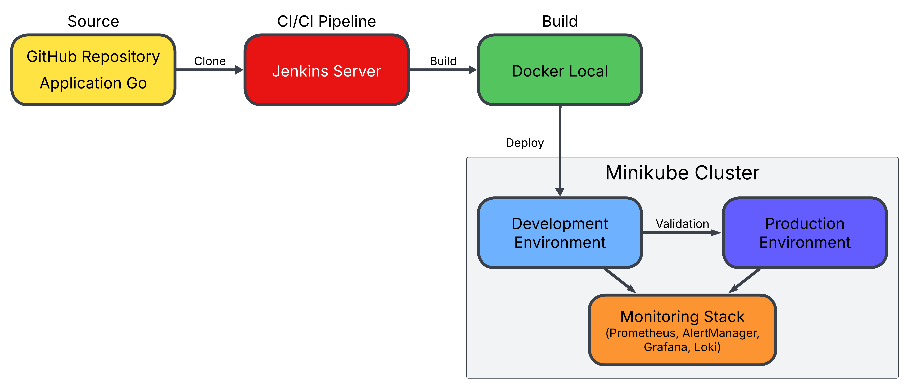
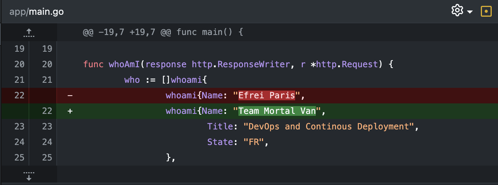

# ST2DCE-PRJ: Build And Deploy Application on a Docker Kubernetes Infrastructure

## Table of Content

> [**Introduction**](#introduction)  
>
> [**Reflexion on Achieving Full Continuous Developement**](#reflexion-on-achieving-full-continuous-development)  
>
> [**Part 1 : Building and Deploying**](#part-1--building-and-deploying)  
> 1. [Setup and Prerequisites](#setup-and-prerequisites)  
> 1. [Building an Image of the App](#building-an-image-of-the-app)  
> 1. [Setting the Pipeline using Jenkins](#setting-the-pipeline-using-jenkins)  
> 1. [Deploying the Application using Kubernetes Minikube](#deploying-the-application-onto-kubernetes-minikube)  
>
> [**Part 2 : Monitoring and Incident Management**](#part-2--monitoring-and-incident-management)  
> 1. [Setup and Prerequisites](#setup-and-prerequisites-1)  
> 1. [Configuring the Alert Manager](#configuring-the-alert-manager)  
> 1. [Managing Alerts](#managing-alerts)   
>
> [**Part 3 : Logs Management**](#part-3--logs-management)  
> 1. [Setup and Prerequisites](#setup-and-prerequisites-2)  
> 1. [Configuring the Loki](#configuring-the-loki)  
> 1. [Query Results](#query-results)  
>
> [**Conclusion**](#conclusion)  

## Introduction

Our Goal in this project is to build a Jenkins CI/CD pipeline and deploy it as a Docker image to a Minikube Kubernetes.   
For this project, a Go application was used to construct, test and monitor this infrastructure.

## Reflexion on Achieving Full Continuous Development

Here is a diagram representing our chosen global architecture:  

  

- **Source Code Repository**: GitHub where developers push their changes. It can trigger the CI/CD pipeline when new changes are pushed to specific branches. It allows a version control  
  
- **CI/CD Tool Jenkins**: for automating the CI/CD pipeline.   

- **Build and Containerization**:
  - **Docker**: used to containerize the application by building a Docker image. 
  -	**Minikube Image Load**: load the image directly into Minikube using minikube image load.

- **Kubernetes Cluster (Minikube in local development)**:
The local Kubernetes cluster where the application is deployed is minikube.   
The application is deployed using Kubernetes deployment and service YAML files, which define the application's desired state and how it should be exposed.

- **Monitoring**:
  -	**Prometheus & Grafana**: These tools are used for monitoring the application's health and performance in Kubernetes. Prometheus collects metrics from the application and Kubernetes, and then Grafana is used to visualize these metrics. 
  -	AlertManager: Configured with Prometheus, it sends alerts based on the defined thresholds 

- **Notifications and Alerts**: Alerts are triggered by Prometheus . These alerts are handled by AlertManager, which can send notifications by email for example

## Part 1 : Building and Deploying 

### Setup and Prerequisites

For this part of the project, you need to have installed Docker, Jenkins and Kubernetes

### Building an Image of the App

#### Modifying the App

You can excute the Go application locally with these commands:  

    # Exécuter l'application en local
    go run main.go

    # Test dans un autre terminal
    curl http://<your local path>/whoami

#### Creating a Dockerfile

    # Utiliser l'image officielle Go
    FROM golang:1.21-alpine

    # Définir le répertoire de travail
    WORKDIR /app

    # Copier le fichier main.go
    COPY main.go .

    # Initialiser le module Go
    RUN go mod init devops-cd-project

    # Compiler l'application
    RUN go build -o main .

    # Exposer le port 8080
    EXPOSE 8080

    # Commande pour démarrer l'application
    CMD ["./main"]

#### Build the image

    docker build -t go-app:v1 .

#### Running the Docker Container

    docker run -p 8080:8080 go-app:v1

#### Display the Result

    curl http://localhost:8080/whoami

### Setting the Pipeline using Jenkins
 
# **TODO**

### Deploying the application onto Kubernetes Minikube

#### Start minikube 

    minikube start

#### Create the namespaces for dev and prod

    kubectl apply -f kubernetes/namespaces.yaml

#### Load the image into Minikube 

> It is required because of : `imagePullPolicy: Never`

    minikube image load go-app:v1

#### Deploy in the development environlment

    kubectl apply -f kubernetes/dev/deployment.yaml
    kubectl apply -f kubernetes/dev/service.yaml

#### Deploy in the production environlment

    kubectl apply -f kubernetes/prod/deployment.yaml
    kubectl apply -f kubernetes/prod/service.yaml

#### Visualise Results
Production environment:  

    minikube service go-app-service -n production –url

Development environment:  

    minikube service go-app-service -n development --url

## Part 2 : Monitoring and Incident Management

### Setup and Prerequisites

#### Install Prometheus Stack

    helm install prometheus prometheus-community/kube-prometheus-stack -f values-prometheus.yaml

#### Install Grafana

    helm install grafana grafana/grafana -f values-grafana.yaml

### Configuring the Alert Manager

#### Setup alerts

    kubectl apply -f pod-not-running-rule.yaml
    kubectl apply -f high-memory-usage-rule.yaml
    
#### Setup AlertManager

    kubectl apply -f alertmanager-config.yaml
    
#### Access Grafana Web UI

    minikube service grafana --url   
    
### Managing Alerts

To test the "PodNotRunning" alert set up, we can create a pod with a non-existent image by running :  

    kubectl run test-pod --image=non-existent-image

This will trigger the alert because Kubernetes will be unable to start the pod.
To check the alerts on promotheus we run :  

    kubectl port-forward svc/prometheus-kube-prometheus-prometheus 9090:9090  

Result is on `http://localhost:9090/query` by executing the query `ALERTS`:  

## Part 3 : Logs Management

### Setup and Prerequisites

### Configuring the Loki

### Query Results

## Conclusion

