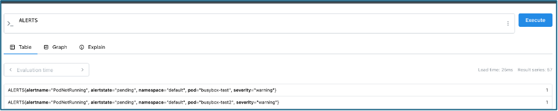

# ST2DCE-PRJ: Build And Deploy Application on a Docker Kubernetes Infrastructure

## Table of Content

> [**Introduction**](#introduction)  
>
> [**Reflexion on Achieving Full Continuous Developement**](#reflexion-on-achieving-full-continuous-development)  
>
> [**Part 1 : Building and Deploying**](#part-1--building-and-deploying)  
> 1. [Setup and Prerequisites](#setup-and-prerequisites)  
> 1. [Building an Image of the App](#building-an-image-of-the-app)  
> 1. [Setting the Pipeline using Jenkins](#setting-the-pipeline-using-jenkins)  
> 1. [Deploying the Application using Kubernetes Minikube](#deploying-the-application-onto-kubernetes-minikube)  
>
> [**Part 2 : Monitoring and Incident Management**](#part-2--monitoring-and-incident-management)  
> 1. [Setup and Prerequisites](#setup-and-prerequisites-1)  
> 1. [Configuring the Alert Manager](#configuring-the-alert-manager)  
> 1. [Managing Alerts](#managing-alerts)   
>
> [**Part 3 : Logs Management**](#part-3--logs-management)  
> 1. [Setup and Prerequisites](#setup-and-prerequisites-2)  
> 1. [Configuring the Loki](#configuring-the-loki)  
> 1. [Query Results](#query-results)  
>
> [**Conclusion**](#conclusion)  

## Introduction

Our Goal in this project is to build a Jenkins CI/CD pipeline and deploy it as a Docker image to a Minikube Kubernetes.   
For this project, a Go application was used to construct, test and monitor this infrastructure.

## Reflexion on Achieving Full Continuous Development

Here is a diagram representing our chosen global architecture:  

  

- **Source Code Repository**: GitHub where developers push their changes. It can trigger the CI/CD pipeline when new changes are pushed to specific branches. It allows a version control  
  
- **CI/CD Tool Jenkins**: for automating the CI/CD pipeline.   

- **Build and Containerization**:
  - **Docker**: used to containerize the application by building a Docker image. 
  -	**Minikube Image Load**: load the image directly into Minikube using minikube image load.

- **Kubernetes Cluster (Minikube in local development)**:
The local Kubernetes cluster where the application is deployed is minikube.   
The application is deployed using Kubernetes deployment and service YAML files, which define the application's desired state and how it should be exposed.

- **Monitoring**:
  -	**Prometheus & Grafana**: These tools are used for monitoring the application's health and performance in Kubernetes. Prometheus collects metrics from the application and Kubernetes, and then Grafana is used to visualize these metrics. 
  -	AlertManager: Configured with Prometheus, it sends alerts based on the defined thresholds 

- **Notifications and Alerts**: Alerts are triggered by Prometheus . These alerts are handled by AlertManager, which can send notifications by email for example


## Part 1 : Building and Deploying 

### Setup and Prerequisites

For this part of the project, you need to have installed Docker, Jenkins and Kubernetes

### Building an Image of the App

#### Modifying the App


You can excute the Go application locally with these commands:  
```bash
# Run the app locally
go run main.go

# Test the output of the app
curl http://<your local path>/whoami
```

#### Creating a Dockerfile
```bash
# Use offical Go image
FROM golang:1.21-alpine

# Set the working directory
WORKDIR /app

# Copy main.go file
COPY main.go .

# Initialize the Go module
RUN go mod init devops-cd-project

# Compile the app
RUN go build -o main .

# Expose port 8080
EXPOSE 8080

# Command to start the application
CMD ["./main"]
```


#### Build the image
```bash
docker build -t go-app:v1 .
```

#### Running the Docker Container

```bash
docker run -p 8080:8080 go-app:v1
```

#### Display the Result

```bash
curl http://localhost:8080/whoami
```

### Setting the Pipeline using Jenkins
 
# **TODO**

### Deploying the application onto Kubernetes Minikube

#### Start minikube 

```bash
minikube start
```

#### Create the namespaces for dev and prod

```bash
kubectl apply -f kubernetes/namespaces.yaml
```

#### Load the image into Minikube 

> It is required because of : `imagePullPolicy: Never`

```bash
minikube image load go-app:v1
```

#### Deploy in the development environlment

```bash
kubectl apply -f kubernetes/dev/deployment.yaml
kubectl apply -f kubernetes/dev/service.yaml
```

#### Deploy in the production environlment

```bash
kubectl apply -f kubernetes/prod/deployment.yaml
kubectl apply -f kubernetes/prod/service.yaml
```

#### Visualise Results
Production environment:  

```bash
minikube service go-app-service -n production –url
```

Development environment:  

```bash
minikube service go-app-service -n development --url
```

## Part 2 : Monitoring and Incident Management

### Setup and Prerequisites

#### Adding the Helm repositories

```bash
helm repo add prometheus-community https://prometheus-community.github.io/helm-charts
helm repo add grafana https://grafana.github.io/helm-charts
helm repo update
```

#### Install Prometheus Stack

```bash
helm install prometheus prometheus-community/kube-prometheus-stack -f values-prometheus.yaml
```

#### Install Grafana

```bash
helm install grafana grafana/grafana -f values-grafana.yaml
```

### Configuring the Alert Manager

#### Setup alerts

```bash
kubectl apply -f pod-not-running-rule.yaml
kubectl apply -f high-memory-usage-rule.yaml
```
    
#### Setup AlertManager

```bash
kubectl apply -f alertmanager-config.yaml
```
    
#### Access Grafana Web UI
```bash
minikube service grafana --url 
```  
    
### Managing Alerts

To test the "PodNotRunning" alert set up, we can create a pod with a non-existent image by running :  

```bash
kubectl run test-pod --image=non-existent-image
```
This will trigger the alert because Kubernetes will be unable to start the pod.

To test the "HighMemoryUsage" alert set up, we can create a pod with a  image and run :  

```bash
kubectl run memory-test --image=progrium/stress -- -m 1 --vm-bytes 512M --timeout 300s
```

This will trigger the alert as the image asks for a lot of memory.

To check the alerts, we access them on promotheus by running :  

```bash
kubectl port-forward svc/prometheus-kube-prometheus-prometheus 9090:9090  
```

Result is on `http://localhost:9090/query` by executing the query `ALERTS`:  



## Part 3 : Logs Management

### Setup and Prerequisites

#### Installer Loki Stack via Helm

```bash
helm install loki grafana/loki-stack -f values-loki.yaml --set grafana.enabled=false
```

### Configuring the Loki

#### Configuration as a Grafana data source

```bash
kubectl apply -f update-datasources.yaml
kubectl rollout restart deployment grafana
```

#### Déployment of the dashboard for the errors logs

```bash
kubectl apply -f dashboard-configmap.yaml
```

#### Déployment of a pod generating logs for tests

```bash
kubectl apply -f error-generator.yaml -n production
```

#### Command to generate a custom log for tests   

```bash
kubectl exec -n production error-generator -- sh -c 'echo "CUSTOM ERROR: test message $(date)"'
```

#### Vérification of the Loki Configuration

```bash
# Vérify that Loki is correctly deployed
kubectl get pods | grep loki

# Vérify that the error-generating pod is working
kubectl get pods -n production
kubectl logs -n production error-generator
```

### Visualise Query Results

#### How to

1. Accéder à Grafana via l'URL ou le port-forward
2. Se connecter avec les identifiants (admin/admin par défaut)
3. Pour visualiser les logs via le dashboard:
   - Dans le menu de gauche, sélectionner "Dashboards"
   - Trouver et ouvrir le dashboard "Production Error Logs"
   
4. Pour visualiser les logs via Explore:
   - Dans le menu de gauche, cliquer sur "Explore"
   - Sélectionner "Loki" comme source de données
   - Entrer la requête: `{namespace="production"} |= "error"`
   - Cliquer sur "Run Query"

#### Useful Loki querys

- Tous les logs d'erreur dans le namespace production:
  `{namespace="production"} |= "error"`

- Logs d'erreur personnalisés:
  `{namespace="production"} |= "CUSTOM ERROR"`

- Logs d'erreur sans les messages normaux:
  `{namespace="production"} |= "error" !~ "normal"`

## Conclusion


